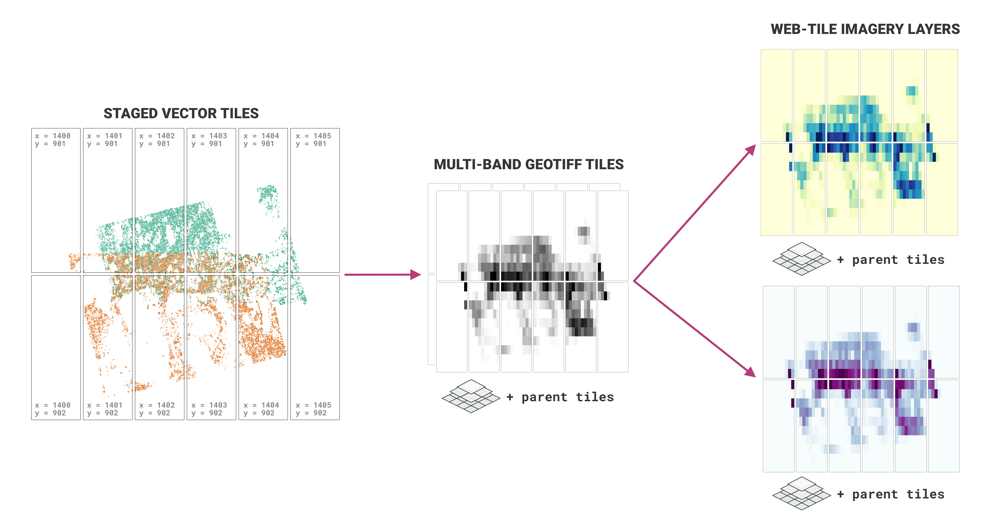

# Viz-raster: raster data processing for geospatial visualization

- **Authors**:Robyn Thiessen-Bock ; Juliet Cohen ; Matthew B. Jones ; Kastan Day ; Lauren Walker; Rushiraj Nenuji; Alyona Kosobokova
- **DOI**: [10.18739/A2GF0MZ4X](https://ezid.cdlib.org/id/doi:10.18739/A2GF0MZ4X)
- **License**: [Apache 2](https://opensource.org/license/apache-2-0/)
- [Package source code on GitHub](https://github.com/PermafrostDiscoveryGateway/viz-raster)
- [Submit bugs and feature requests](https://github.com/PermafrostDiscoveryGateway/viz-raster/issues/new)

Converts pre-tiled vector output from the [PDG
viz-staging](https://github.com/PermafrostDiscoveryGateway/viz-staging) step
into a series of GeoTIFFs and web-ready image tiles at a range of zoom levels.
View the content under `example` to see the type of output produced. Most parts
of the process are configurable, including the methods used to summarize vector
data into rasters, the color palette, and the size of the tiles. See the
documentation in `ConfigManager.py` for more details.



## Citation

Cite this software as:

> Robyn Thiessen-Bock, Juliet Cohen, Matt Jones, Lauren Walker, Rushiraj Nenuji, Alyona Kosobokova. 2025. Viz-raster: raster data processing for geospatial visualization (version 1.0.0). Arctic Data Center. doi: 10.18739/A2GF0MZ4X

## Install

Requires Python version `3.9` or `3.10` and `libspatialindex` or `libspatialindex-dev`

### Prerequisites

1. Follow the instructions to install [`libspatialindex`](https://libspatialindex.org/en/latest/) or [`libspatialindex-dev`](https://packages.ubuntu.com/bionic/libspatialindex-dev)
2. Make sure that Python version 3.9 or 3.10 is installed (try `which python3.9`).

### Installation Options

#### Option 1: Using uv (recommended)

Install `pdgraster` from GitHub repo using uv:

```bash
# Install the package
uv pip install git+https://github.com/PermafrostDiscoveryGateway/viz-raster.git

# Or install with development dependencies
uv pip install "git+https://github.com/PermafrostDiscoveryGateway/viz-raster.git[dev]"
```

#### Option 2: Using pip

Install `pdgraster` from GitHub repo using pip:

```bash
# Install the package
pip install git+https://github.com/PermafrostDiscoveryGateway/viz-raster.git

# Or install with development dependencies
pip install "git+https://github.com/PermafrostDiscoveryGateway/viz-raster.git[dev]"
```

#### Option 3: Using a virtual environment

If you prefer to use a virtual environment:

```bash
# Create and activate a virtual environment
python3.9 -m venv venv
source venv/bin/activate  # On macOS/Linux
# or
venv\Scripts\activate     # On Windows

# Install with uv
uv pip install git+https://github.com/PermafrostDiscoveryGateway/viz-raster.git

# Or install with pip
pip install git+https://github.com/PermafrostDiscoveryGateway/viz-raster.git

# To deactivate the virtual environment when done
deactivate
```

#### For Development

If you're developing this package, clone the repository and install in editable mode:

```bash
# Clone the repository
git clone https://github.com/PermafrostDiscoveryGateway/viz-raster.git
cd viz-raster

# Option 1: Using uv to create and manage virtual environment
uv venv
source .venv/bin/activate
uv pip install -e ".[dev]"

# Option 2: Using uv with custom virtual environment
python3.9 -m venv venv
source venv/bin/activate
uv pip install -e ".[dev]"

# Option 3: Using pip with virtual environment
python3.9 -m venv venv
source venv/bin/activate
pip install -e ".[dev]"

# Option 4: Direct installation with uv (creates managed environment)
uv pip install -e ".[dev]"

# Option 5: Direct installation with pip
pip install -e ".[dev]"
```

The development dependencies include:
- `pytest >= 7` - for running tests
- `black >= 24.1.1` - for code formatting
- `pre-commit >= 3.5.0` - for pre-commit hooks


## Raster data processing for the PDG tiling pipeline

This repository contains code that converts pre-tiled vector output from the [PDG viz-staging](https://github.com/PermafrostDiscoveryGateway/viz-staging) step into a series of GeoTIFFs and web-ready image tiles at a range of zoom levels for the [Permafrost Discovery Gateway](https://permafrost.arcticdata.io/) (PDG) workflow. The rasterization process:

1. Takes staged vector tiles as input
2. Converts vector data to raster format using configurable summarization methods
3. Applies color palettes and styling
4. Generates web-ready image tiles at multiple zoom levels
5. Outputs both GeoTIFF files and image tiles suitable for web visualization

The process is highly configurable, allowing customization of:
- Summarization methods for converting vector data to rasters
- Color palettes and styling options
- Tile sizes and zoom level ranges
- Output formats and quality settings

## Development

Build and test using standard Python tools.

- To test, run `pytest` from the root of the package directory
- To format code, run `black .`
- VS Code configuration is setup to configure tests as well

## License

```
Copyright [2013] [Regents of the University of California]

Licensed under the Apache License, Version 2.0 (the "License");
you may not use this file except in compliance with the License.
You may obtain a copy of the License at

http://www.apache.org/licenses/LICENSE-2.0

Unless required by applicable law or agreed to in writing, software
distributed under the License is distributed on an "AS IS" BASIS,
WITHOUT WARRANTIES OR CONDITIONS OF ANY KIND, either express or implied.
See the License for the specific language governing permissions and
limitations under the License.
```
