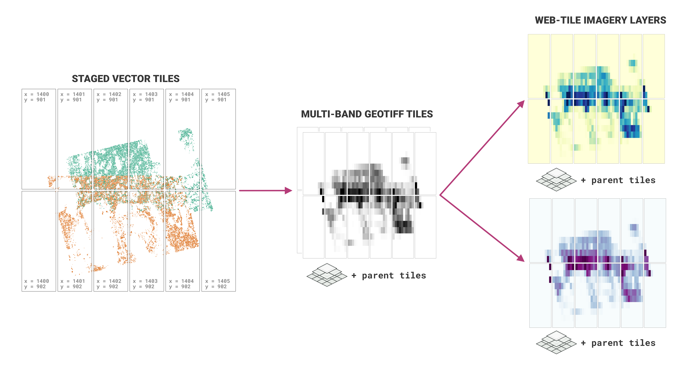

# PDG Raster

## PDG visualization pipeline for raster processing

Converts pre-tiled vector output from from the [PDG
viz-staging](https://github.com/PermafrostDiscoveryGateway/viz-staging) step
into a series of GeoTIFFs and web-ready image tiles at a range of zoom levels.
View the content under `example` to see the type of output produced. Most parts
of the process are configurable, including the methods used to summarize vector
data into rasters, the color palette, and the size of the tiles. See the
documentation in `ConfigManager.py` for more details.

## Install

Requires Python version `3.9` and `libspatialindex` or `libspatialindex-dev`

1. Follow the instructions to install [`libspatialindex`](https://libspatialindex.org/en/latest/) or [`libspatialindex-dev`](https://packages.ubuntu.com/bionic/libspatialindex-dev)
2. Make sure that Python version 3.9 is installed (try `which python3.9`).
3. Install `pdgraster` from GitHub repo using pip: `pip install git+https://github.com/PermafrostDiscoveryGateway/viz-raster.git`

## Usage

1. Create a config JSON file for the raster job, see [PDG-Staging docs](https://github.com/PermafrostDiscoveryGateway/viz-staging/blob/develop//docs/config.md) for details,  `help(pdgstaging.ConfigManager)` for all configuration options, and `pdgstaging.ConfigManager.defaults` for default config values.

**From the command line:**
- run: `python -m pdgraster -c '/path/to/config.json'`

**In python:**
See [`example/main.py`](example/main.py) for a complete example.